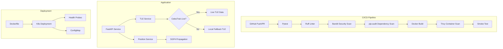

# Secure Satellite Ground System — DevSecOps Demo

A realistic satellite ground-system API demonstrating a complete DevSecOps workflow: backend development, CI/CD pipelines, automated testing, Docker containerization, security scanning, and Kubernetes deployment readiness.

Built to connect DevSecOps practices with a satellite ground-system context. The same domain as Boeing Defense, Space & Security's Ground Software Engineering team.

## Why This Project

Satellite ground systems require the highest levels of software reliability, security, and deployment discipline. This project demonstrates how modern DevSecOps practices, automated testing, static analysis, dependency scanning, container security, and infrastructure-as-code, apply to a mission critical context where failure is not an option.

## Architecture



## Tech Stack

| Layer | Technology |
|-------|-----------|
| Backend | Python 3.12, FastAPI, Pydantic |
| Orbital Mechanics | sgp4 (NORAD SGP4 propagation) |
| Data Source | CelesTrak public TLE data + local fallback |
| Testing | pytest |
| Linting | ruff |
| Security Scanning | Bandit (SAST), pip-audit (SCA), Trivy (container) |
| Containerization | Docker (non-root, slim base) |
| Orchestration | Kubernetes (Deployment, Service, ConfigMap) |
| CI/CD | GitHub Actions |

## API Endpoints

| Method | Endpoint | Description |
|--------|----------|-------------|
| GET | `/health` | Service health, version, data source status |
| GET | `/satellites` | List all tracked satellites |
| GET | `/satellites/{name}/position` | Current lat/lon/altitude |
| GET | `/satellites/{name}/health` | Operational health summary |
| GET | `/docs` | Auto-generated API documentation |

### Tracked Satellites

- **ISS** (NORAD 25544) — International Space Station
- **HUBBLE** (NORAD 20580) — Hubble Space Telescope
- **NOAA-19** (NORAD 33591) — Weather satellite
- **LANDSAT-9** (NORAD 49260) — Earth observation
- **SENTINEL-6A** (NORAD 46984) — Ocean monitoring

## Quick Start

### Local Development

```bash
# Clone
git clone https://github.com/YOUR_USERNAME/sat-ground-devsecops.git
cd sat-ground-devsecops

# Install
pip install -r requirements.txt

# Run
uvicorn app.main:app --reload

# Test
pip install -r requirements-dev.txt
pytest tests/ -v
```

### Docker

```bash
# Build and run
docker-compose up --build

# Or manually
docker build -t sat-ground-tracker .
docker run -p 8000:8000 sat-ground-tracker
```

Then visit: `http://localhost:8000/docs`

### Example Requests

```bash
# Health check
curl http://localhost:8000/health
# {"status":"healthy","version":"1.0.0","data_source":"local_fallback","satellites_loaded":5}

# List satellites
curl http://localhost:8000/satellites

# ISS position
curl http://localhost:8000/satellites/ISS/position
# {"name":"ISS","latitude":41.26,"longitude":-95.01,"altitude_km":420.5,"timestamp_utc":"...","data_source":"local_fallback"}

# Satellite health
curl http://localhost:8000/satellites/ISS/health
```

## CI/CD Pipeline

The GitHub Actions pipeline runs on every push and PR to `main`:

1. **Checkout** — Pull source code
2. **Setup Python 3.12** — Consistent environment
3. **Install dependencies** — App + dev dependencies
4. **pytest** — 18 automated tests covering all endpoints, edge cases, and fallback behavior
5. **ruff** — Linting and code quality
6. **Bandit** — Static Application Security Testing (SAST) — finds common Python security issues
7. **pip-audit** — Software Composition Analysis (SCA) — checks dependencies for known CVEs
8. **Docker build** — Containerize the application
9. **Trivy** — Container image vulnerability scan (CRITICAL + HIGH severity)
10. **Smoke test** — Start container, verify `/health` returns 200

## Security Controls

| Control | Tool | What It Catches |
|---------|------|-----------------|
| Static analysis (SAST) | Bandit | Hardcoded secrets, unsafe functions, injection risks |
| Dependency scanning (SCA) | pip-audit | Known CVEs in Python packages |
| Container scanning | Trivy | OS and library vulnerabilities in Docker image |
| Input validation | Pydantic | Malformed request data |
| Non-root container | Dockerfile | Privilege escalation |
| No hardcoded secrets | Environment vars | Credential exposure |
| Health monitoring | K8s probes + /health | Service availability |

## Testing Strategy

```
tests/
├── test_api.py
│   ├── TestHealthEndpoint          — 3 tests
│   ├── TestSatellitesEndpoint      — 4 tests
│   ├── TestPositionEndpoint        — 7 tests
│   ├── TestHealthSatelliteEndpoint — 3 tests
│   └── TestFallbackBehavior        — 2 tests
```

Tests validate: endpoint responses, field presence, value ranges (lat/lon/altitude), error handling (404 for unknown satellites), case-insensitive lookup, and fallback behavior when live data is unavailable.

## Kubernetes Deployment

```bash
# Apply manifests (requires a running cluster)
kubectl apply -f k8s/service.yaml
kubectl apply -f k8s/deployment.yaml
```

Includes:
- **Deployment** with 2 replicas, resource limits, liveness/readiness probes
- **Service** (ClusterIP) for internal routing
- **ConfigMap** for environment-based configuration
- **Non-root security context** enforced at pod level

## Future Improvements

- Add Prometheus metrics endpoint (`/metrics`) for operational monitoring
- Implement Redis caching for TLE data across replicas
- Add Ansible playbooks for automated server provisioning
- Integrate with Grafana dashboards for real-time satellite tracking visualization
- Add mutual TLS between services
- Implement role-based access control (RBAC) for API endpoints
- Add integration tests that run against the Docker container in CI

**License:** MIT
